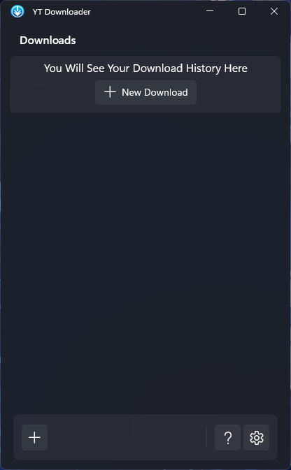
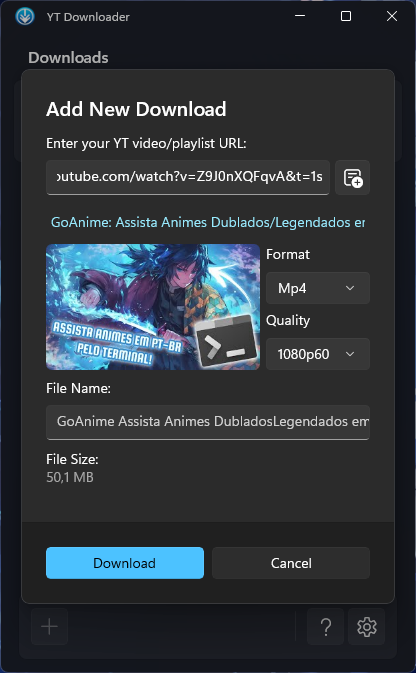
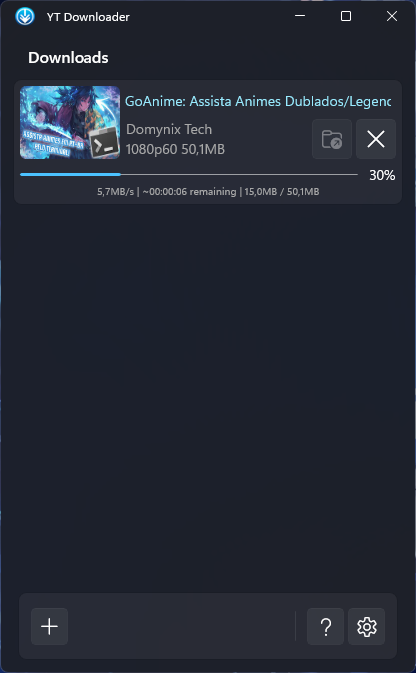

  <h1>
     YT Downloader
  </h1>

  
  
  
  

    <h2>📖 Overview</h2>

This repository contains the implementation of YT Downloader. This software is a downloader for videos, music, and playlists from YouTube, using C# and [YouTubeExplode](https://github.com/Tyrrrz/YoutubeExplode). The interface is built using WinUI 3.

  

    
    
    
  

    <h2>📥 Installation</h2>

- ⬇️ With Installer:
  - Go to [Releases](https://github.com/TXG0Fk3/YTDownloader/releases) and download the latest version `YTDownloader.Setup.exe`;
  - Run `YTDownloader.Setup.exe`, then proceed with the installation, confirm what is necessary, and you're done;
  - After installation, YT Downloader will be available in your Start Menu.
- 📦 With [Scoop Package Manager](https://scoop.sh/):
  - Ensure you have Scoop running on your machine; you can install it [here](https://scoop.sh/);
  - Add [Asterism](https://github.com/TXG0Fk3/Asterism/) Bucket running this command on Windows Terminal (CMD/Powershell): `scoop bucket add asterism https://github.com/TXG0Fk3/Asterism`;
  - And finally install YT Downloader: `scoop install asterism/ytdownloader`;
  - The YT Downloader will now be available in your Start Menu, in a folder called "Scoop Apps"; you can run it from there.

    <h2>🤝 Contributing</h2>
  
Contributions are welcome! You can help improve **YT Downloader** in several ways:

- 🐛 **Report issues**: Found a bug or unexpected behavior? Open an [issue](../../issues) describing the problem.
- ✨ **Suggest features**: Have an idea to make YT Downloader better? Share it in the issues tab.
- 🔧 **Submit pull requests**: Fix bugs, improve code quality, or add new features.

  <h2>📜 License</h2>

This project is licensed under the GPL-3.0. See the [LICENSE](LICENSE) file for details.

